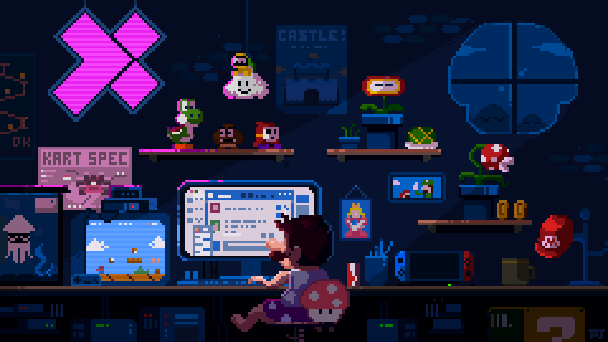

# Hello there!   I'm agustin!💜

Frontend student looking for opportunities to work in web development, which allow my intellectual growth and develop my technical knowledge, to grow together with the company and my coworkers.

 
 

💜💜💜💜💜💜💜💜💜💜💜💜💜💜💜💜💜💜💜💜💜💜💜💜💜💜💜💜💜💜

 

- 🤓 I’m currently learning and focusing on Javascript/Typescript (advanced)

-  🌱 I working daily with [React](https://reactjs.org).

- ❓ Ask me about anything  

- ⚡ I love coffe ☕ and gaming 🎮

 
 

💜💜💜💜💜💜💜💜💜💜💜💜💜💜💜💜💜💜💜💜💜💜💜💜💜💜💜💜💜💜

 

## My Skill Set

 

💜 **<u>Main stack</u>**:

       

💜  **<u>Libraries:</u>**

     

💜  **<u>Other technologies:</u>**

    

 

## Github Stats

 

## My musical taste 🕺🏻

  
<!-- LINKS -->
[website]: https://portfolio-argentina-programa.web.app/
[linkedin]: https://www.linkedin.com/in/eduardo-agustin-morales/
